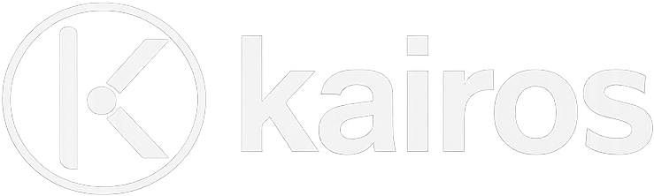

<p align="center">
  
</p>

A Claude Code skill that turns a job description into a tailored, ATS-clean, advisor-reviewed CV PDF, without the AI-written smell. **kairos** (Greek: *the right moment to act*) is your career advisor: it converses with you about your real experience, maps it to the Job Description, and writes copy you can defend in an interview.

---

## The problem

Most AI CV tools produce the same paragraph you have seen a thousand times: *"experienced engineer applying to X, passionate about Y, motivated to leverage Z to drive impact..."*. Recruiters can smell it in ten seconds. So can hiring managers. The issue is not that AI cannot write; it is that nobody has bothered to codify what a good CV actually looks like. kairos does.

## What kairos does

Three things other CV tools skip:

**1. It interviews you before it writes anything.**
Every tailoring session starts with 3 to 5 native-picker questions (`AskUserQuestion`) that surface depth, recency, and stories the canonical CV does not expose. The tailored CV reformulates *what you just told kairos*, not what it can infer from text alone. Most tools skip this entirely and guess.

**2. A stronger model reviews the whole draft before the PDF is saved.**
After the tailored CV is written, an Opus advisor (or a transparent self-audit against the same checklist) reads every section, every bullet, every keyword injection, and the Summary against the writing rules and a falsifiability test. Weak bullets get rewritten. Filler gets cut. Dash violations get caught. The PDF is compiled *after* that pass, not before.

**3. Defend mode makes you rehearse your own claims.**
After the PDF is compiled, kairos plays a skeptical interviewer for 3 to 5 minutes: it picks the highest-stakes claims on the tailored CV (specific numbers, named systems, strong outcome verbs) and challenges them via `AskUserQuestion` pickers. You find out which bullets you cannot defend in 30 seconds *before* you submit the application or walk into the real interview.

The writing standard enforced throughout: a documented ban list (no filler phrases, no label-style transitions, no aspirational closers), a falsifiability test on every sentence, and the rule that every claim must be verifiable against the CV body. See `docs/WRITING_RULES.md`.

### Example: what the quality pass catches

Same candidate, same Job Description (Data Platform Engineer). The Summary is the easiest place to see the difference, but the same discipline runs over every bullet, every reorder, every keyword injection, and every reformulated phrase in the tailored CV.

**Before** (typical AI output):
> Experienced engineer applying to a Data Platform role, with a strong background in distributed systems and a proven track record of building scalable pipelines. Passionate about leveraging AI to drive internal tooling improvements.

**After** (kairos):
> Data platform engineer with five years building streaming Kafka pipelines and a Python feature store serving two in-house ML teams, with open-source contributions to a widely used retrieval library. Shipped an internal evaluator for retrieval-augmented Large Language Model (LLM) assistants that cut review time by 40 percent across forty daily queries, with the whole stack open-sourced under Apache 2.0.

Everything in the *after* is a real, verifiable claim that a skeptical reader can fact-check against the CV body. Nothing in the *before* is. The bullets, the section order, and the keyword injections in the tailored CV go through the same review.

See `examples/mohamed_ali_summary_annotated.md` for the full walkthrough.

## Full pipeline

Paste a job description (or a URL) into Claude Code. kairos runs:

```
  Paste Job Description or URL
        │
        ▼
  ┌─────────────┐
  │  Interview  │  kairos asks you first — surfaces depth the CV does not expose
  └─────────────┘
        │
        ▼
  ┌─────────────┐
  │   Tailor    │  rewrites from what you just said, not from guesswork
  └─────────────┘
        │
        ▼
  ┌─────────────┐
  │  Advisor    │  Opus reviews every bullet before the PDF is compiled
  │    Gate     │
  └─────────────┘
        │
        ▼
  ┌─────────────┐
  │   Defend    │  challenges your highest-stakes claims — before you submit
  └─────────────┘
        │
        ▼
    Submit
```

1. **Parse the Job Description**: extract keywords, detect your role archetype, flag fit signals.
2. **Interview**: 3 to 5 native-picker questions surface depth and stories the canonical CV does not expose.
3. **Tailor the CV**: section reordering, bullet rewriting, keyword injection - all against real experience, never invented.
4. **Advisor gate**: Opus (or a transparent self-audit) reviews every section, every bullet, every keyword injection before the PDF is compiled.
5. **PDF compile** via Playwright, honouring CSS `@page` rules. Always two pages or fewer.
6. **Respond**: if the application form includes written questions, draft answers under the same writing rules.
7. **Defend**: skeptical-interviewer dry-run on the finished CV - you find out which claims you cannot defend before you submit.

## Quick start

```bash
# 1. Clone into your Claude skills directory (available across all projects)
git clone https://github.com/melrefaiy2018/kairos.git ~/.claude/skills/kairos

# 2. Install Playwright
npm install -g playwright && npx playwright install chromium

# 3. Configure
cp ~/.claude/skills/kairos/config.example.yaml ~/.claude/skills/kairos/config.yaml
# Edit config.yaml: name, email, location, links
```

Claude Code picks up the skill automatically on the next session - no restart needed. See `docs/INSTALL.md` for the full setup including dropping in your own CV.

## First-time use

Open Claude Code in any folder and paste a Job Description or URL. kairos detects it is a fresh workspace and runs a short setup:

1. Asks a few questions to create `config.yaml` (name, email, location, links).
2. Asks for your CV - you can paste it, give a file path, or build it from scratch step by step.
3. Runs the full pipeline on your first application.

After setup your workspace looks like this:

```
<any folder you choose>/
├── config.yaml              ← created on first run via a short interview
├── templates/
│   └── cv_template.html     ← your canonical CV (built or imported on first run)
├── scripts/                 ← copied automatically from the kairos install
└── applications/
    ├── preparing/           ← kairos writes here during the pipeline
    │   └── <Company>_<Role>_<YYYY-MM-DD>/
    │       ├── README.md            ← job metadata, score, tailoring notes, identified gaps
    │       ├── cv_tailored.html     ← tailored CV source
    │       ├── cv_tailored.pdf      ← compiled PDF, always two pages or fewer
    │       ├── interview_notes.md   ← your answers from the interview step
    │       └── defend_report.md     ← skeptical-interviewer transcript and weak spots flagged
    └── submitted/           ← move folders here once you send the application
```

### Each application folder is a permanent record

Every folder kairos creates is more than an output directory - it is a full dossier for that application. Long after you submit, everything is there: the original job description, the tailored CV, the gaps kairos identified between your profile and the role, your interview-step answers, and the defend transcript showing which claims you struggled to back up.

This means you can return to any application folder before an interview and use it as a live prep session:

```bash
cd applications/submitted/Acme_MLEngineer_2026-03-10
claude
```

Open Claude Code in that folder and ask things like:
- *"What gaps did kairos flag for this role?"*
- *"Walk me through the defend report - which bullets were challenged?"*
- *"Quiz me on the claims in section 3 of the CV."*
- *"The interview is tomorrow - what should I focus on?"*

Claude reads `README.md`, `interview_notes.md`, and `defend_report.md` and turns them into a targeted prep session grounded in your actual application, not a generic mock interview.

## Every subsequent run

```bash
cd <your folder>
claude
```

Paste a Job Description or URL - kairos picks up the existing config and CV automatically.

## Commands

| Command | What it does |
|---|---|
| `/kairos start` | Invoke manually if auto-activation does not trigger. |
| `/kairos defend` | Rehearse claims on a CV you already submitted. |
| `/kairos respond` | Draft answers to essay questions found after the CV was done. |
| `/kairos recompile` | Rebuild the PDF after a manual edit. |
| `/kairos tracker` | Check status across all applications in `preparing/` and `submitted/`. |
| `/kairos update` | Apply latest updates from GitHub. |

## Configuration

Everything personal lives in `config.yaml` (gitignored). See `config.example.yaml` for the full annotated schema: identity, paths, archetypes, PDF format, advisor toggle.

```yaml
identity:
  name: "Mohamed Ali"
  email: "mohamed@example.com"
  location: "Remote / City, Country"
  sponsorship_required: false
  links:
    linkedin: ""
    github: ""
    scholar: ""
    portfolio: ""
```

## Customising archetypes for your domain

Archetypes are role buckets (AI Platform, ML Research, Data Platform, etc.) that shape how kairos frames your CV. Edit the `archetypes:` block in `config.yaml` with names and Job Description signals specific to your field:

```yaml
archetypes:
  - name: "Computational Biology"
    jd_signals: ["protein", "genomics", "sequencing", "bioinformatics"]
```

kairos uses these to detect which framing to lead with in the Summary and Skills reorder.

## How it stays honest

- **Dash rule**: no em-dashes or en-dashes anywhere. Hyphens only. Grepped on every save.
- **Ban list**: filler phrases (*proven track record*, *results-oriented*, *synergies*) are enforced at the advisor gate.
- **Falsifiability test**: every sentence in the Summary must be fact-checkable against the CV body.
- **Advisor gate**: if Opus is available, a stronger reviewer sees the full draft and fixes issues before PDF compile. If not, kairos runs the same checklist as a self-audit, transparently.
- **Never invent experience**: interview answers that contradict the CV are surfaced to the user, not silently added.

## Updating kairos

kairos checks for updates automatically every 3 days. After a pipeline completes, if new commits are available you will see:

> "kairos has N update(s) available. Run `/kairos update` to apply, or ignore to stay on the current version."

Run `/kairos update` and confirm. kairos pulls the latest changes and tells you what was updated. Your `config.yaml`, CV, and applications folder are never touched by an update.

To update manually at any time: `/kairos update`.

## Inspiration

kairos was inspired by [santifer/career-ops](https://github.com/santifer/career-ops). Huge respect to that work.

The difference is focus. career-ops is built for volume: scanning portals, triaging hundreds of listings, batch processing. kairos is built for the application you actually care about: it interviews you first, tailors the CV to what you just said, runs a quality pass before the PDF is compiled, and rehearses you on your own claims before you submit. One application done properly beats ten done generically.

## Roadmap

kairos v0.1 ships the CV pipeline. Cover-letter drafting and interview-prep modes are on the roadmap.

## FAQ

**Will it invent experience?**
No. The writing rules explicitly ban fabrication, and the advisor gate checks every claim against the CV body. Interview answers that contradict the CV are surfaced to you, not silently added.

**Does it need Claude Opus?**
No. The advisor gate uses Opus when available and falls back to a self-audit using the same checklist when it is not. You can force-skip with `advisor.enabled: false`.

**Can I use my own CV instead of the Mohamed Ali template?**
Yes. Replace `templates/cv_template.html` with your own, keeping the CSS and section order. The styling is ATS-tuned; the content is yours.

**Does it work with LaTeX?**
Not yet. HTML + Playwright PDF is v0.1. LaTeX is on the roadmap.

**Is my data sent anywhere?**
Only to Claude via Claude Code, like any other skill. No third-party service. Your `config.yaml`, CV, and applications folder stay on your machine.

## License and credits

MIT License. See `LICENSE`.


kairos runs inside [Claude Code](https://claude.ai/code). It is a skill, not a standalone CLI. Contributions welcome.

## Philosophy

The hardest part of a tailored CV is writing copy you can defend in an interview. Most AI tools optimise for keyword coverage and formatting; kairos optimises for falsifiability. Every bullet, every section reorder, every keyword injection, and every Summary sentence has to survive a skeptical reader who has the rest of the CV in front of them.

> "The right moment to act is when you can describe your work in one sentence a skeptical reader cannot dismiss."

---

If kairos helped you land a better application, a star on the repo is appreciated. It is the signal that keeps this project going.
